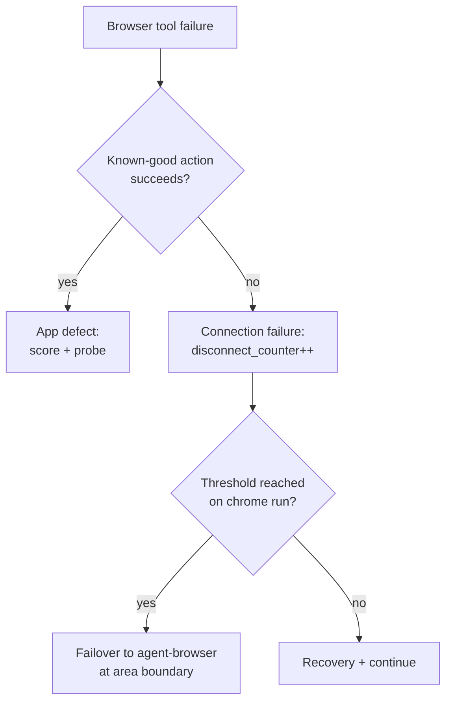

# feat: ce-user-test browser substrate — tool-neutral engine contract with agent-browser default

## Summary

Rewrite ce-user-test's browser layer as a tool-neutral action contract with agent-browser as the default engine and claude-in-chrome MCP as the opt-in mode for watching a run in the user's real logged-in session. One engine reference file carries the verb-to-engine mapping, engine selection, area-boundary failover, and replay-before-blame failure attribution; every area and journey records which engine scored it.

---

## Problem Frame

ce-user-test hardcodes the claude-in-chrome MCP down to its frontmatter. That produces four distinct costs:

- **Cross-platform violation.** claude-in-chrome is Claude-Code-only, in a plugin shipped to Codex, Cursor, and Gemini. This is the suite's one remaining platform-specific dependency.
- **WSL aborts.** Phase 0 detects WSL and aborts outright, even though a working CLI engine exists.
- **Fragile substrate on the hot path.** Extension disconnects trended 6→10 per run; `references/connection-resilience.md` exists entirely to manage that fragility.
- **Execution-bias attribution.** Every mid-run tool failure is treated as transient — retry once, then count toward abort. A real app defect that breaks a tool call gets retried and absorbed into the disconnect counter instead of being scored and probed (GUITester, arXiv 2601.04500).

Meanwhile both sibling skills (`ce-test-browser`, `ce-dogfood`) already mandate the agent-browser CLI exclusively, and the prior engine evaluation (docs/brainstorms/2026-03-18-user-test-headless-browser-engines-brainstorm.md) found the visible window was never serving its stated purpose: users read the report afterward rather than watching the run.

---

## Key Decisions

- **agent-browser is the default engine when both are available.** claude-in-chrome becomes an explicit opt-in (`engine: chrome` in test-file frontmatter, or user request at run start) for runs where the user wants to watch live or needs their real browser session. The visible/shared-login experience remains first-class — chosen, not defaulted. This supersedes the March 2026 brainstorm's "revisit after 5+ passing eval runs" gate, which guarded a then-speculative swap that subsequent review cycles and production runs have since de-risked.
- **Login lives in agent-browser's persistent profile.** First run against an authenticated app: the user signs in once in the agent-browser window; the CLI profile carries the session across all later runs. Chrome opt-in is reserved for apps where the user's real session or data matters, not as the general auth answer.
- **Failover fires only at area boundaries.** Every area is scored by exactly one engine, keeping per-area engine attribution honest for the future calibration deck. Journeys are engine-atomic. This mirrors the existing proactive-restart rule, which already defers reloads to area boundaries.
- **Replay-before-blame replaces blind retry.** On any browser tool failure, a known-good minimal action runs first; its result attributes the failure to the app (score it, probe it) or the connection (recovery path) before any retry occurs.
- **The connection-resilience apparatus is rewired, not deleted.** The proactive `mcp_restart_threshold` reload stays as a chrome-engine rule — it targets the extension's service-worker idle bug, which failover cannot fix. The abort endpoint becomes failover.
- **One engine reference file.** Phases 2–3 are rewritten in neutral action verbs; a single new reference holds the per-verb adapter table, engine selection, failover rules, and the chrome-specific content absorbed from `browser-input-patterns.md` and `connection-resilience.md`.
- **Requirements are tiered for severability.** The engine-neutral contract and default swap are the core value. Failover and replay-before-blame are severable layers: if upstream review pressure on the follow-up PR demands a smaller change, either layer can be split out without redesign, and the failover tier states its own fallback behavior.

---

## Requirements

**Core — tool-neutral contract and default engine**

- R1. Phases 2–3 of the skill are expressed in tool-neutral action verbs (navigate, read-page, evaluate, screenshot, click, fill) with no `mcp__claude-in-chrome__*` tool names in the phase prose.
- R2. A single new engine reference file maps each verb to its claude-in-chrome MCP tool and its agent-browser CLI command, and owns engine selection, failover rules, and engine-specific failure handling. It absorbs the chrome-specific content of `skills/ce-user-test/references/browser-input-patterns.md` and `skills/ce-user-test/references/connection-resilience.md`.
- R3. When both engines are available, agent-browser is the default. Chrome MCP runs only on explicit opt-in: `engine: chrome` in test-file frontmatter or a user request at run start.
- R4. agent-browser CLI invocation follows the conventions established in `skills/ce-test-browser/SKILL.md` and `skills/ce-dogfood/SKILL.md` (snapshot-with-refs interaction model, `--headed` available on demand).
- R5. If agent-browser is absent and chrome MCP is unavailable, the skill points to `/ce-setup` and stops — no improvised fallback tooling. If agent-browser is absent but the run opted into chrome MCP and it is connected, the run proceeds on chrome.
- R6. WSL detection routes the run to agent-browser instead of aborting. The Phase 0 WSL abort is removed.
- R7. The skill's frontmatter `description` and intro no longer name claude-in-chrome as the skill's substrate; the skill loads and runs on non-Claude-Code platforms where agent-browser is installed.
- R8. Authenticated apps run on agent-browser's persistent profile. On first contact with a login wall, the run pauses once: the user signs in in the agent-browser window (headed), then the run continues; later runs reuse the profile.
- R9. Every scored area and every journey records an engine attribution field in `.user-test-last-run.json`. The v11 evidence/ledger/commit-engine layer is otherwise untouched — evidence types (action/dom/timing/count) remain substrate-neutral.

**Severable tier — mid-run failover**

- R10. When a chrome-opted run reaches the disconnect threshold, the run diverts remaining areas to agent-browser instead of aborting. The swap takes effect only at an area boundary.
- R11. If the engine dies mid-area, the area is marked with `skip_reason: engine-failure` and re-run from scratch on the new engine. No area's evidence mixes two engines.
- R12. Journeys are engine-atomic. On engine failure at any checkpoint, the journey is recorded as interrupted, and after failover the whole journey re-runs from checkpoint 1 on the new engine.
- R13. If the failover target's profile is not authenticated for the app under test, the run pauses once with a sign-in instruction (same mechanism as R8), then continues. This behavior belongs to this tier: severing failover removes it.
- R14. Severance fallback: if this tier is dropped, chrome-opted runs at the disconnect threshold keep today's abort-with-recovery behavior, plus a one-line suggestion to re-run on the default engine.

**Severable tier — replay-before-blame**

- R15. On any browser tool failure, before any retry, the run executes a known-good minimal action: navigate to `app_url` by default, overridable per test file via a `known_good_action` frontmatter field.
- R16. If the known-good action succeeds, the original failure is attributed to the app: it is scored and probed as a finding, and does not increment the disconnect counter. If it fails, the failure is attributed to the connection and enters the recovery path.
- R17. Replay-before-blame replaces the unconditional retry-once rule as the first step of chrome-side failure handling.

**Resilience rewiring (chrome-engine rules)**

- R18. The proactive reload at `mcp_restart_threshold` remains, scoped as a chrome-engine rule (it mitigates the extension's service-worker idle failure). `disconnect_counter` and disconnect pattern tracking remain; the counter's threshold endpoint is failover (R10) when that tier ships, or the R14 fallback otherwise.
- R19. agent-browser gets its own thin failure rule in the engine reference: its failures are process-level, not connection-level, so no call counter or proactive reload — replay-before-blame (when present) plus a bounded retry, then surface the error.

**Docs repositioning**

- R20. The skill frontmatter description, `docs/skills/ce-user-test.md`, and the README inventory row are updated to the new default in the same change — all three currently lead with the visible-Chrome-window identity and must not be left to drift.

---

## Key Flows

- F1. Engine selection (Phase 2)
  - **Trigger:** Run start after context load.
  - **Steps:** Read `engine:` frontmatter and user request → chrome opt-in? verify MCP connected → otherwise verify agent-browser installed → WSL forces agent-browser → neither available: `/ce-setup` pointer and stop.
  - **Covers:** R3, R5, R6.
- F2. Chrome-run failover
  - **Trigger:** `disconnect_counter` reaches threshold on a chrome-opted run.
  - **Steps:** Finish or mark the current area (`skip_reason: engine-failure` if it died mid-area) → swap to agent-browser at the boundary → if login wall, pause for one-time sign-in → re-run any engine-failure area and any interrupted journey from the start on the new engine → remaining areas proceed; each area's attribution records the engine that scored it.
  - **Covers:** R10–R13, R9.
- F3. Failure attribution
  - **Trigger:** Any browser tool call fails mid-run.
  - **Steps:** Run known-good action → success: score the original failure as an app finding, generate a probe, no disconnect increment → failure: increment `disconnect_counter`, enter recovery (chrome: reconnect guidance / threshold check; agent-browser: bounded retry then surface).
  - **Covers:** R15–R17, R19.

---

## Acceptance Examples

- AE1. **Covers R6, R3.** Given a WSL environment with agent-browser installed, when `/ce-user-test` runs, then the run executes fully on agent-browser with no abort.
- AE2. **Covers R10, R13.** Given a chrome-opted run against an authenticated app whose agent-browser profile has never signed in, when the disconnect threshold is hit, then the run pauses once with a sign-in instruction and completes the remaining areas on agent-browser.
- AE3. **Covers R15, R16.** Given a mid-run `click` failure caused by an app crash while the connection is healthy, when replay-before-blame runs, then the `app_url` navigation succeeds, the crash is scored and probed as a finding, and `disconnect_counter` does not increment.
- AE4. **Covers R9, R11.** Given a run where engine failure killed area 3 of 5 mid-area, when the run JSON is written, then area 3 carries `skip_reason: engine-failure` plus a fresh score from its re-run, and every area's attribution names exactly one engine.

---

## Scope Boundaries

- Other engines (Lightpanda, Perplexity Comet) — evaluated and deferred in the March 2026 brainstorm; the verb contract makes adding them cheaper later.
- The calibration deck (ideation idea 3) — consumes the R9 attribution field but is separate work.
- Changes to the v11 evidence/ledger/commit-engine layer beyond the attribution field.
- The CLI testing path (Phase 2.5) — already engine-independent; unchanged.
- Headless CI/CD automation of user-test runs.

---

## Dependencies / Assumptions

- Branches off `feat/user-test-skill-v2`; if upstream review of EveryInc#1070 reshapes that branch, rebase before opening this PR. Reviewer comments on chrome portability, if any, feed directly into this work.
- The March 2026 "revisit after 5+ passing eval runs" gate is treated as superseded (see Key Decisions).
- Scoring variance across engines is a real risk, accepted and made measurable by R9 rather than mitigated here.
- agent-browser's persistent profile actually persists sessions across invocations for the apps under test (holds for the sibling skills' usage; verify during planning).

---

## Outstanding Questions

**Deferred to Planning**

- Whether agent-browser runs headless or headed by default (the user chose plain agent-browser default over a headed-default option, implying headless with `--headed` on demand — confirm against run-time ergonomics).
- Exact verb table contents and whether `find`/batch-read verbs join the six seed verbs.
- Where the failover threshold value lives (`caps-registry.json` alongside `mcp_restart_threshold`, or a new key).
- How engine choice and failover events surface in the report's SIGNALS section.
