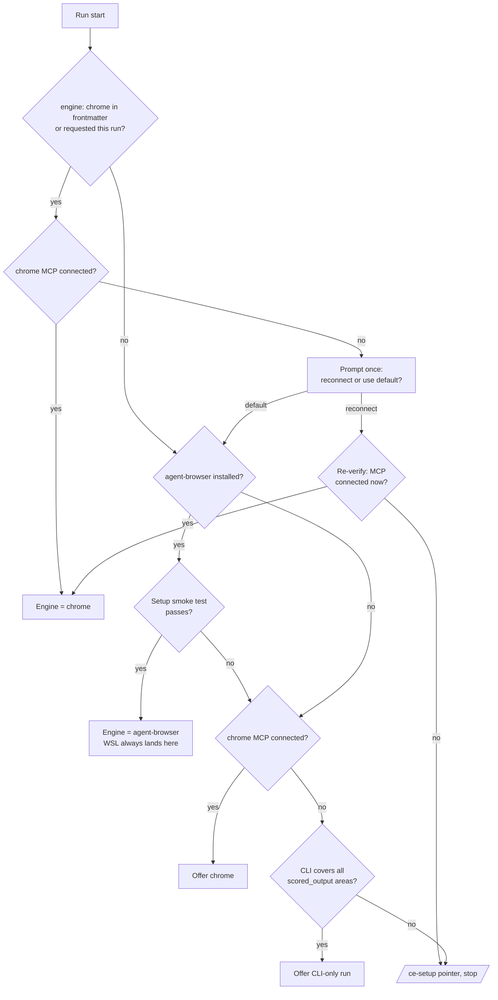
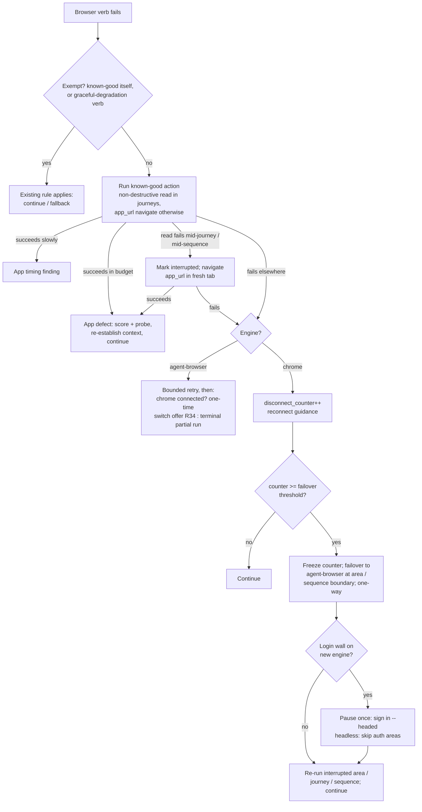

# feat: ce-user-test tool-neutral browser engine contract with agent-browser default

## Summary

Rewrite ce-user-test's browser layer as a tool-neutral action contract: agent-browser CLI as the default engine, claude-in-chrome MCP as opt-in, one new engine reference file owning the verb adapter table, engine selection, area-boundary failover, and replay-before-blame attribution. The run JSON gains per-area engine attribution under a v12 schema bump. Requirements and product decisions come from the origin doc; this plan folds in resolutions to sixteen flow-analysis gaps as amendment requirements R21–R33, a review-added R34, plus the mechanical touch list.

---

## Problem Frame

The origin doc (docs/plans/2026-07-06-001-user-test-browser-substrate-plan.md) carries the full framing: chrome-MCP hardcoding is the suite's one cross-platform violation, WSL aborts outright, the extension is the fragile engine on the hot path (disconnects 6→10 per run), and blind retry-once absorbs real app defects into the disconnect counter. Both sibling skills already mandate agent-browser.

---

## Requirements

Origin requirements R1–R20 govern (see origin doc). Flow analysis surfaced gaps in their edge behavior; the amendments below continue the origin's R-numbering and each names the origin requirement it modifies.

**Engine selection**

- R21. (amends R5, F1) The existing CLI-only fallback is preserved: before the `/ce-setup` stop, if `cli_test_command` covers all `scored_output` areas, offer "run CLI-only?" as today.
- R22. (amends F1) A chrome-opted run whose MCP is unavailable at start prompts once — reconnect chrome, or run on agent-browser — and never falls back silently. If the user chooses reconnect and the MCP is still unavailable after one re-verify, the run stops with the `/ce-setup` pointer.
- R23. Phase 2's environment sanity check doubles as the engine smoke test; if agent-browser fails setup and chrome MCP is connected, offer chrome before stopping.

**Failover state**

- R24. (amends R10) Failover is one-directional per run (chrome → agent-browser only) and persists across remaining iterate-mode runs; iterate-mode's partial-run trigger becomes "both engines failed," not "disconnect."
- R25. (amends R18) At failover the chrome `disconnect_counter` freezes; agent-browser failures are tracked in a separate field so the SIGNALS disconnect delta stays chrome-only.
- R26. (amends R11) Both engines failed is a terminal partial-run state: remaining areas get `skip_reason: engine-failure`, completed areas' results are written, commit is skipped per existing partial-run safety.
- R27. (extends R12) Cross-area probe sequences are engine-atomic like journeys: failover defers until the sequence completes, or the interrupted sequence re-runs whole on the new engine.
- R34. (extends R23) The mid-run reverse-offer (agent-browser → chrome) is a one-time switch at an area boundary; accepting it consumes both failover directions, so the next engine failure on either engine is the R26 terminal state. The switch persists across remaining iterate-mode runs like R24.

**Replay-before-blame**

- R28. (amends R15) During journeys and cross-area probe sequences the known-good default is a non-destructive current-tab read. If that read fails, the journey or sequence is marked interrupted and `app_url` navigation runs in a fresh tab as a second-stage discriminator — navigation success attributes the original failure to the app; only a double failure attributes to the connection. Elsewhere the known-good is `app_url` navigation followed by re-establishing area context before the run resumes.
- R29. (amends R15) The known-good action itself and the existing graceful-degradation fallbacks (screenshot fails → continue; evaluate fails → per-element fallback) are exempt from replay-before-blame; a failed known-good action routes directly to connection attribution.
- R30. (amends R16) The known-good action has its own timeout budget; slow-but-completed attributes to the app as a timing finding, not the connection.

**Login pause**

- R31. (amends R8, R13) The login pause relaunches agent-browser `--headed` at the wall, fires at most once per session, and in headless or pipeline contexts marks auth-gated areas `skip_reason: auth-blocked` instead of blocking; a second login wall mid-run is recorded as a ledger anomaly and dispositioned, never scored as area quality.

**Attribution and schema**

- R32. (amends R9) The attribution enum is `agent-browser` | `chrome` | `cli`; CLI-only-scored areas record `cli`; engine failures land in a dedicated per-area/per-journey field, never overloading `skip_reason`; interrupted journey attempts are kept alongside their re-runs in `journeys_run`.
- R33. (amends R9) The additive fields ship as a `schema_version` bump to 12, following the repo's per-wave bump precedent: defaults in both scripts' parity dictionaries, a `MIGRATION_TABLE` entry, and a "v12 additions" table in the schema doc.

Origin AE4 is superseded by R32: an engine-failure area carries the dedicated failure field plus its re-run score; `skip_reason: engine-failure` is reserved for areas never re-run (R26).

---

## Key Technical Decisions

- **One engine reference file, load-stub inline.** `references/browser-engines.md` is the single canonical home for the verb table, engine selection, failover, replay-before-blame, and per-engine resilience. SKILL.md keeps only load-bearing triggers as load stubs that name the failure mode of skipping the load — no workable inline summary, or agents never open the file (docs/solutions/skill-design/post-menu-routing-belongs-inline.md, monolith-split anti-patterns).
- **Verb contract: navigate, read-page, evaluate, screenshot, click, fill, find, wait.** The origin's six seed verbs plus `find` (element refs are how agent-browser interacts at all) and `wait` (both engines need explicit async waits). Chrome maps to `mcp__claude-in-chrome__*` tools; agent-browser maps to the sibling-skill command vocabulary (`open`, `snapshot -i`, `click @ref`, `fill @ref`, `screenshot`, `wait`) plus `eval <js>` for evaluate, `get text` / `get html` for read-page, and `find <locator>` for find — the full eight-verb mapping verified against the installed CLI — invoked as the direct binary, never `npx`.
- **Login via agent-browser session persistence.** Upstream supports `--profile <dir>` and `--session`/`--restore` (cookies + localStorage across restarts, state in `~/.agent-browser/sessions/`) — the origin's one-time sign-in model is confirmed viable. Exact flag choice is an implementation detail; the plan pins only the behavior (R8, R31).
- **Engine opt-in lives in test-file frontmatter plus invocation reasoning.** `engine: chrome` is a test-file frontmatter key added via `append_frontmatter_default` (precedent: `cli_test_command`, `mcp_restart_threshold`). Detection of a per-run request is phrased as reasoning over the user's invocation, never `$ARGUMENTS` scanning (docs/solutions/skill-design/arguments-token-is-claude-only-in-skill-bodies.md).
- **New caps-registry key `failover_disconnect_threshold` (value 3).** `mcp_restart_threshold` keeps its name and value, re-scoped in meaning to the chrome engine; renaming it would force a pointless migration.
- **Budget language generalizes; key names don't.** Prose "MCP call" budgets in touched references become "browser call" budgets; `mcp_restart_threshold` stays chrome-scoped under its existing name. The budget unit is one verb invocation; engine-internal snapshot/ref refreshes count inside their verb, keeping budgets engine-comparable.
- **Schema bump to v12.** Every additive field wave (v8–v11) bumped the version; unversioned optional fields would be mechanically safe but break the documented migration convention and the parity tests' expectations.
- **Failover and attribution written as an explicit state machine.** Check-then-branch transitions, no state carried in prose narration (docs/solutions/skill-design/git-workflow-skills-need-explicit-state-machines.md).
- **Per-engine three-tier resilience is preserved.** Preflight check, mid-run recovery with the engine's specific recovery command, cumulative tracking — the superseded piece is only the abort endpoint, which becomes failover (docs/solutions/2026-02-26-agent-guided-state-and-mcp-resilience-patterns.md).
- **Severability is a review affordance, not a code branch.** The plan implements all tiers; severance maps to named content sections, not unit IDs. The failover tier is the failover/iterate-persistence sections of U1, U2, and U4 plus the `failover_disconnect_threshold` cap and engine-failure schema fields in U3. The replay tier is the replay-before-blame sections of U1 and U2 plus the `known_good_action` frontmatter in U3. Severing a tier means excising those sections and substituting origin R14's fallback text, which reads `failover_disconnect_threshold` rather than a hardcoded 3.

---

## High-Level Technical Design

Engine selection at Phase 2 (covers R3, R5, R6, R21–R23):

Failure attribution and failover state machine (covers R10–R17, R24–R30):

---

## Implementation Units

### U1. Engine reference file

- **Goal:** Create the single canonical engine layer: verb table, selection rules, per-engine resilience, failover state machine, replay-before-blame, login handling.
- **Requirements:** Origin R2–R6, R8, R10–R19; amendments R21–R31, R34.
- **Dependencies:** None.
- **Files:** Create `skills/ce-user-test/references/browser-engines.md`; delete `skills/ce-user-test/references/connection-resilience.md` and `skills/ce-user-test/references/browser-input-patterns.md` (content absorbed).
- **Approach:** Sections: verb table (8 verbs × 2 engines, agent-browser column following `skills/ce-test-browser/SKILL.md` command vocabulary, defining the browser-call budget unit as one verb invocation with engine-internal snapshot/ref refreshes counted inside their verb); engine selection (F1 flowchart logic as check-then-branch prose); chrome resilience (replay-before-blame first, reconnect guidance, `disconnect_counter`, freeze-at-failover, proactive `mcp_restart_threshold` reload, modal-dialog note); agent-browser failure rule (bounded retry, no counters, one-time reverse switch per R34, terminal partial run); failover (boundary rules, one-directional, iterate persistence, login pause); replay-before-blame (defaults per context, second-stage fresh-tab discriminator for journeys, exemptions, timeout budget, post-replay context re-establishment); login/session (persistent session flags, one-time headed sign-in, headless skip). The engine-portable JS payloads from browser-input-patterns.md (React-safe input, batched reads, async waits) become `evaluate`-verb payloads usable on both engines.
- **Patterns to follow:** `skills/ce-test-browser/SKILL.md` agent-browser CLI reference and install-check wording; three-tier resilience shape from `docs/solutions/2026-02-26-agent-guided-state-and-mcp-resilience-patterns.md`; one canonical home per rule.
- **Test scenarios:** Covered by U6 evals plus `tests/skill-conventions.test.ts` reference-integrity (new file exists; no dangling links to deleted files anywhere in the skill).
- **Verification:** Every rule from the two deleted files is either present in the new file, re-scoped to chrome, or consciously dropped with the drop noted in the PR description; no rule text duplicated into SKILL.md.

### U2. SKILL.md rewrite

- **Goal:** Rewrite Phases 0/2/3 in tool-neutral verbs with engine selection, WSL routing, and load stubs to the engine reference.
- **Requirements:** Origin R1, R3, R5–R7; amendments R21–R23.
- **Dependencies:** U1.
- **Files:** `skills/ce-user-test/SKILL.md`.
- **Approach:** Frontmatter description rewritten tool-neutral (≤2 sentences, "Use when" shape, no claude-in-chrome mention). Phase 0: WSL detection routes to agent-browser instead of aborting. Phase 2: engine selection per F1 including the preserved CLI-only offer and the chrome-verify prompt; sanity check doubles as smoke test. Phase 3: verbs replace `mcp__claude-in-chrome__*` names; "MCP call" budget/timing prose becomes "browser call"; graceful degradation and modal-dialog handling move to or defer to the engine reference; Connection Resilience stub and the Reference Files row point at `browser-engines.md`. Failover and replay triggers appear only as load stubs naming the skip-failure mode.
- **Execution note:** Keep the diff reviewable — rewrite the touched phases, don't reflow untouched sections.
- **Patterns to follow:** Load-stub discipline (`docs/solutions/skill-design/post-menu-routing-belongs-inline.md`); capability-not-tool phrasing; existing `SKILL_DIR` anchor blocks are engine-independent and stay verbatim.
- **Test scenarios:** `tests/user-test-protocol-names.test.ts` pinned SKILL.md prose strings still match; `tests/skill-conventions.test.ts` passes; description ≤1024 chars. Behavior scenarios in U6.
- **Verification:** `grep -c "claude-in-chrome" SKILL.md` returns only the engine-reference-scoped mentions (frontmatter and phase prose clean); a reader of Phases 2–3 cannot tell which engine is active.

### U3. Schema v12 and deterministic scripts

- **Goal:** Add per-area/per-journey engine attribution and engine-failure fields under schema v12; add the new caps key and test-file frontmatter fields.
- **Requirements:** Origin R9; amendments R24–R26, R31–R33.
- **Dependencies:** U1 (field semantics).
- **Files:** `skills/ce-user-test/references/last-run-schema.md`, `skills/ce-user-test/scripts/migrate-test-file.py`, `skills/ce-user-test/scripts/commit-engine.py`, `skills/ce-user-test/scripts/caps-registry.json`, `skills/ce-user-test/references/test-file-template.md`, `tests/user-test-protocol-names.test.ts`, `tests/user-test-scripts.test.ts`, `tests/user-test-commit-engine.test.ts`.
- **Approach:** v12 additions: per-area `engine` (`agent-browser`|`chrome`|`cli`), per-area and per-journey engine-failure records (name decided at implementation; not `skip_reason`), journey entries keep interrupted attempts alongside re-runs, new `skip_reason` enum values `engine-failure` and `auth-blocked`. Pre-v12 areas migrate to `engine: null` (scored before attribution existed); the enum constrains only newly written values. Bump `CURRENT_SCHEMA_VERSION` to 12 in both scripts; update `RUN_JSON_AREA_DEFAULTS` identically in both (byte-parity test); extend `MIGRATION_TABLE` and `merge_last_run` so the payload carries the engine field through commit. caps-registry gains `failover_disconnect_threshold` (3, "consecutive chrome disconnects before failover"); both the failover trigger and the run-end SIGNALS disconnect-analysis threshold read this key; `mcp_restart_threshold` meaning re-worded chrome-scoped. test-file-template documents `engine:` and `known_good_action:` frontmatter with `append_frontmatter_default` fills.
- **Patterns to follow:** v8–v11 additive-wave precedent in `migrate-test-file.py` (`RUN_JSON_*_DEFAULTS`, `migration_defaults_applied`); protocol-name pinning conventions in `tests/user-test-protocol-names.test.ts`.
- **Test scenarios:**
  - Migrating a v11 run JSON fills the new defaults, stamps `schema_version: 12`, and lists the filled fields in `migration_defaults_applied`.
  - A v13 run JSON aborts with `UNKNOWN-VERSION 13`.
  - `RUN_JSON_AREA_DEFAULTS` byte-parity across both scripts passes with the new fields.
  - Covers amended AE4: commit `plan`/`apply` on a payload where one area carries an engine-failure record plus a re-run score validates and persists both.
  - `merge_last_run` preserves the per-area engine field when the payload area carries it and when it doesn't.
  - A test file without `engine:` gets `engine: ""` filled (empty = default engine) and listed in the migration output; one with `engine: chrome` survives migration unchanged.
  - Migrating a v11 run JSON writes `engine: null` on historical areas — never a live engine name.
- **Verification:** `bun test` green including the five user-test suites; schema doc's v12 table matches the pinned name sets in the protocol-names test.

### U4. Failover and atomicity sweep across references

- **Goal:** Align the orchestration references with failover, atomicity, and generalized budget language.
- **Requirements:** Origin R10–R12; amendments R24–R27, R31–R32, R34.
- **Dependencies:** U1, U3.
- **Files:** `skills/ce-user-test/references/probes.md`, `skills/ce-user-test/references/journeys.md`, `skills/ce-user-test/references/iterate-mode.md`, `skills/ce-user-test/references/run-targeting.md`, `skills/ce-user-test/references/queries-and-multiturn.md`, `skills/ce-user-test/references/verification-patterns.md`.
- **Approach:** probes.md: cross-area sequences engine-atomic, proactive-restart interaction extended to cover failover deferral, "MCP call counter" → browser-call language. journeys.md: engine-atomic rule, interrupted-attempt record kept beside the re-run, checkpoint cost accounting in browser calls. iterate-mode.md: failover persists across remaining runs; partial-run trigger reworded to both-engines-failed; between-run reset defined per engine. run-targeting.md and queries-and-multiturn.md: budget tables and novelty budget in browser calls. verification-patterns.md: batch verification via the `evaluate` verb; disconnect-context recording names the verb and engine, not "which MCP tool."
- **Test scenarios:** Test expectation: none — prose alignment; behavior covered by U6 evals and the protocol-names pinned tables (dispositions, evidence types) which these edits must not disturb.
- **Verification:** `grep -rn "mcp__claude-in-chrome" skills/ce-user-test/` returns hits only inside `browser-engines.md`; `bun test tests/skill-conventions.test.ts tests/user-test-protocol-names.test.ts` green.

### U5. Docs repositioning

- **Goal:** Update the three user-facing surfaces that lead with the visible-Chrome identity in the same change.
- **Requirements:** Origin R20.
- **Dependencies:** U2.
- **Files:** `docs/skills/ce-user-test.md`, `README.md`, `docs/skills/README.md`.
- **Approach:** Reposition: exploratory user-testing on the default agent-browser engine, watchable real-session chrome mode as opt-in; WSL supported; prerequisites updated (agent-browser via `/ce-setup`, chrome MCP optional). Keep the pitch honest per the identity framing: the visible mode isn't demoted, it's chosen.
- **Test scenarios:** Test expectation: none — documentation. `tests/release-metadata.test.ts` skill count unchanged (no skill added/removed).
- **Verification:** No remaining "requires claude-in-chrome" or "WSL not supported" claims across the three files.

### U6. Behavioral validation via injected-subagent evals

- **Goal:** Validate the rewritten prose behaves as specified, since plugin skill content caches at session start and in-session dispatch tests pre-edit prose.
- **Requirements:** All behavioral requirements; acceptance examples AE1–AE4 (amended).
- **Dependencies:** U1–U4.
- **Files:** Eval scenarios live with the skill-creator workflow output; no repo files beyond any fixture test files under a scratch project.
- **Approach:** Use the skill-creator injected-subagent eval workflow (per AGENTS.md "Validating Agent and Skill Changes") with the edited source injected at dispatch time.
- **Test scenarios:**
  - Covers AE1: WSL-flagged environment with agent-browser present → run proceeds, no abort.
  - Engine selection: no frontmatter, both engines present → agent-browser chosen; `engine: chrome` + MCP down → the one-time prompt fires, no silent fallback (R22).
  - Covers AE2: chrome-opted run at disconnect threshold → failover at area boundary, login-wall pause instruction, engines recorded per area.
  - Covers AE3: mid-run click failure with healthy connection → known-good succeeds, failure scored as app finding, counter unchanged.
  - Replay exemption: a failed screenshot follows continue-without-screenshots, no replay navigate (R29).
  - Covers amended AE4 (journey facet): engine dies at checkpoint 3 of 5 → interrupted record kept, journey re-run whole on new engine (R12, R32).
- **Verification:** All eval scenarios pass on injected content; full `bun test` green as the final gate.

---

## Scope Boundaries

Carried from origin: other engines (Lightpanda, Comet), the calibration deck (consumes the attribution field), v11 evidence-layer semantics beyond the additive v12 fields, headless CI/CD automation. The CLI testing path's logic is unchanged; it is only added to the attribution enum.

### Deferred to Follow-Up Work

- Severance packaging: if upstream review of the follow-up PR demands a smaller change, the failover or replay tier splits out by excising its named sections (see the severability decision) and substituting origin R14's fallback text.
- `--profile Default` exploration: agent-browser can reuse the user's real Chrome profile login state, which could subsume the chrome opt-in's shared-login differentiator; needs investigation of profile-lock conflicts with a running Chrome.
- `/ce-compound` the v12 migration outcome — no schema-migration learning exists yet for ce-user-test artifacts.

---

## Risks & Dependencies

- **Upstream PR reshape:** branch off `feat/user-test-skill-v2`; rebase before opening this PR if review of EveryInc#1070 changes the base. Reviewer comments on chrome portability feed in directly.
- **Headed/headless state carryover at the login pause:** agent-browser's daemon architecture should share session state between headed and headless invocations, but this is unverified; if it doesn't, the pause flow needs a `--session`-based save/restore hop. Resolve at implementation (U1).
- **Verb mapping fidelity on chrome:** the chrome column's `find`/`click` tools differ in interaction model from agent-browser's ref-based snapshot; the verb table must state per-engine interaction sequences, not pretend 1:1 tool equivalence.
- **Scoring variance across engines:** accepted, made measurable by attribution (origin decision); the calibration deck consumes it later.
- **Shadow copies:** personal ce-user-test copies in `~/.claude/skills/` can shadow the repo version during manual testing; validate only via injected-subagent evals (U6).

---

## Sources & Research

- `skills/ce-test-browser/SKILL.md` (agent-browser command vocabulary, install check, `/ce-setup` wording); `skills/ce-dogfood/SKILL.md` (direct-binary rule, `errors` command); `skills/ce-setup/scripts/check-health` (install command).
- vercel-labs/agent-browser README: `--profile <dir>`, `--session`/`--restore` persistence (cookies, localStorage, login sessions across restarts), `state save`, daemon persistence between commands.
- `tests/user-test-protocol-names.test.ts` (byte-parity and pinned-name constraints); `skills/ce-user-test/scripts/migrate-test-file.py` v8–v11 migration precedent.
- Constraining learnings: `docs/solutions/2026-02-26-agent-guided-state-and-mcp-resilience-patterns.md`, `docs/solutions/skill-design/bundled-script-path-resolution-across-harnesses.md`, `docs/solutions/skill-design/arguments-token-is-claude-only-in-skill-bodies.md`, `docs/solutions/skill-design/post-menu-routing-belongs-inline.md`, `docs/solutions/skill-design/git-workflow-skills-need-explicit-state-machines.md`, `docs/solutions/2026-02-26-monolith-to-skill-split-anti-patterns.md`.
